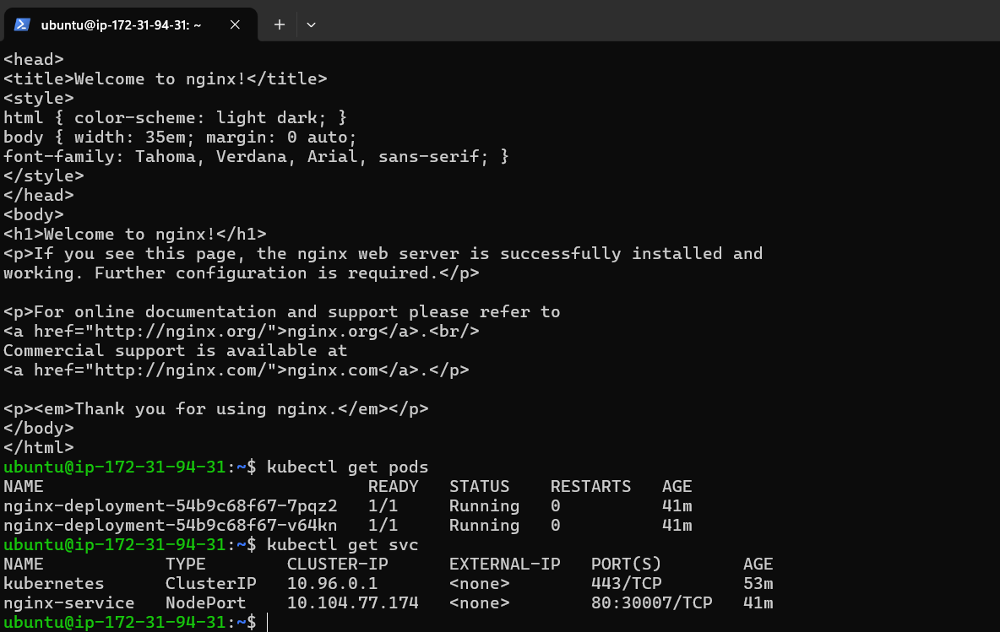
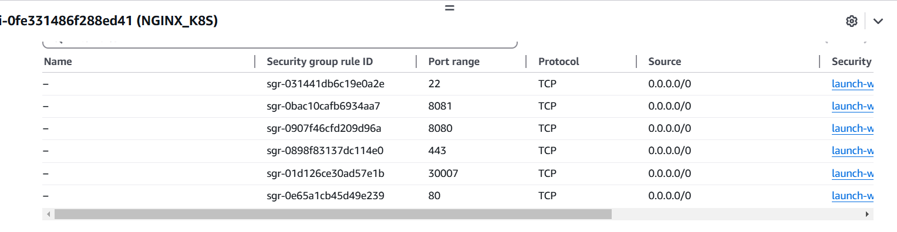
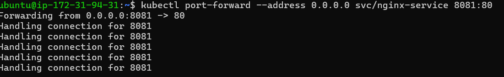
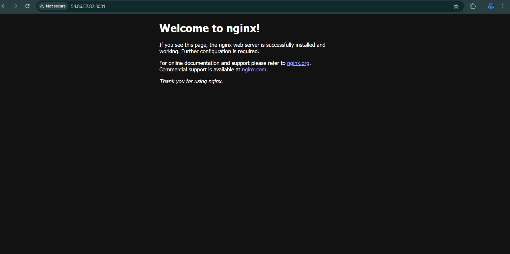

# Deploy Nginx Page  
Deploy a Simple NGINX Application on Kubernetes

### Step-1
## Install minikube and SET UP accordingly.

### Step-2
### ssh the EC2 Instance

### Step-3
```bash
mkdir intership_project || cd intership_project/
```

### Step-4
Lets make the two file which is

#### 1st 
```bash
vim nginx_deployments.yaml
```
```bash
apiVersion: apps/v1
kind: Deployment
metadata:
  name: nginx-deployment
spec:
  replicas: 2
  selector:
    matchLabels:
      app: nginx
  template:
    metadata:
      labels:
        app: nginx
    spec:
      containers:
      - name: nginx
        image: nginx:latest
        ports:
        - containerPort: 80
```
#### 2nd 
```bash
vim nginx_svc.yaml
```
```bash
apiVersion: v1
kind: Service
metadata:
  name: nginx-service
spec:
  selector:
    app: nginx
  type: NodePort
  ports:
  - protocol: TCP
    port: 80
    targetPort: 80
    nodePort: 30007
```

### Step-5
```bash
kubectl apply -f nginx_deployments.yaml
```
```bash
kubectl apply -f nginx_svc.yaml
```
### Step-6
```bash
kubectl get pods
```
```bash
kubectl get svc
```


### Step-6 
#### Allow all security inbounds rules.


### Step 7 (optional)
port forwarding 
```bash
kubectl port-forward --address 0.0.0.0 svc/nginx_svc 8081:80
```


### Step 8

```bash
curl http://54.86.52.82:8081/
```


## Now You can see your webpage!
